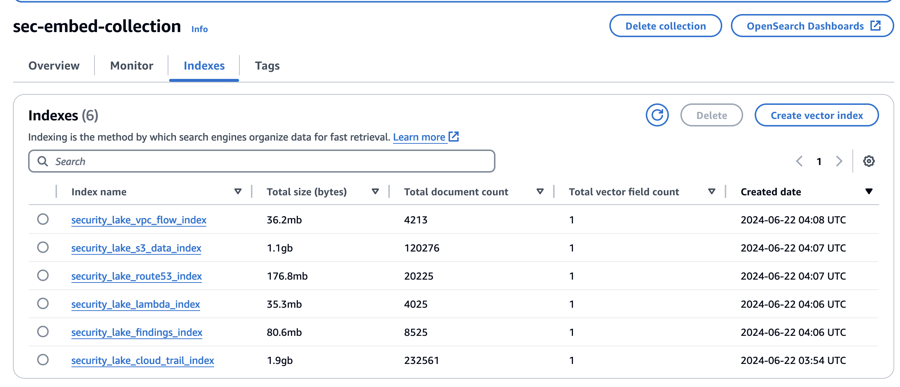

# Cybersecurity GenAI


Cybersecurity GenAI deploys a single page application that allows you to converse with your Security Lake OCSF data via Bedrock Agents. 

## Contents

- [Prerequisites](#prerequisites)
- [Deploy](#deploy)
- [Post Deploy](#post-deployment)
- [Architecture](#architecture)
- [Need more Help?](#need-more-help)

## Prerequisites
The following prerequisites need to be met before running the deployment script.

- [Security Lake Setup and Running](#security-lake-setup-and-running)
- [Database and Tables](#database-and-tables)
- [CDK Setup](#cdk-setup)
- [Bedrock Model Access](#cdk-setup)


### Security Lake Setup and Running
Security Lake setup and running. [See Getting started with Amazon Security Lake](https://docs.aws.amazon.com/security-lake/latest/userguide/getting-started.html)

If you want to set this up in Isengard you will need two accounts in an Organization. The Organization Management account and another account as a security account. To collect CloudTrail management events in Security Lake, you must have at least one CloudTrail multi-Region organization trail that collects read and write CloudTrail management events. If you want CloudTrail you need the two account setup.

### Security Lake Database and Tables
The code is written to use the following database and tables in us-east-1.

```
Database
amazon_security_lake_glue_db_us_east_1

Tables
amazon_security_lake_table_us_east_1_sh_findings_2_0
amazon_security_lake_table_us_east_1_route53_2_0
amazon_security_lake_table_us_east_1_s3_data_2_0
amazon_security_lake_table_us_east_1_vpc_flow_2_0
amazon_security_lake_table_us_east_1_cloud_trail_mgmt_2_0
amazon_security_lake_table_us_east_1_lambda_execution_2_0
```
EKS Audit and WAF are not added yet.  
You will need to upgrade your Security Lake to 2.0 if you are still on the prior version.

You can validate security lake is setup by running test queries against the tables.  
[Security Lake queries for AWS source version 2 (OCSF 1.1.0)](https://docs.aws.amazon.com/security-lake/latest/userguide/subscriber-query-examples2.html)

### CDK Setup
You will need the CDK Installed and your AWS Account Bootstrapped.  
[Getting started with the AWS CDK](https://docs.aws.amazon.com/cdk/v2/guide/getting_started.html)


## Deploy

See [prerequisites](#prerequisites). If everything is ready to go run the deploy script.

Open the `cdk/constants.py` file to set the Email and Open Search  read only role.

The email address is used to sign in. You'll receive an email with the temporary password.

```
# REPLACE EMAIL with your email address
EMAIL = 'xxx@yyyy.com'
```

The Open Search read only role is used to access the collections and indexes.

```
# The AOSS_READ_ONLY_ROLE_ARN is the Read Only role for the Open Search Data Access Policy
# Set this Role Name to add a AOSS Read Only data policy
# example: arn:aws:iam::1234566789012:role/YourRoleName
AOSS_READ_ONLY_ROLE_ARN=""
```

Deployment takes approximately 10 - 15 minutes to deploy.

```
git clone https://github.com/aws-samples/cybersecurity-genai.git
cd solution
./deploy_solution.sh
```

Deploy will first cdk deploy the environment, then it will deploy the single page application. The deploy will output the CloudFront distribution at the end. This URL can also be found in the outputs of the CloudFormation stack.

Continue to the [Post Deployment](#post-deployment) Steps

## Post Deployment
The following steps need to be completed after the deployment script runs.

- [Verify Embedding Processor](#verify-embedding-processor)
- [Verify OpenSearch Collection Indicies](#verify-opensearch-collection-indicies)

### Verify Embedding Processor
Verify the Embedding Processor container is launched and start running. We can navigate to Batch and view the logs to confirm it is working.

Open [AWS Batch Jobs](https://us-east-1.console.aws.amazon.com/batch/home?region=us-east-1#jobs)

If prompted to Choose a job queue select "CdkEmbeddingProcessor-BatchJobQueue".  Click search, this will list the batch jobs.  Notice there will be a batch job running for each index: Findings, VpcFlow, S3 Data, Lambda, Route 53 and Cloud Trail.


Sort by "Created date" to select the most current job. Depending on your timing the Status may be Running or Succeeded. In the Details box click the Log stream name in the lower left.


This will open CloudWatch Logs and take you the corresponding log group.

To confirm the job is working you will look for the index_name, thenconfirm you see there are "rows found". You can also view the query that is run if you want to test it yourself in Athena.


### Verify OpenSearch Collection Indicies
The Embedding Processor will create an index for each Security Lake Data Source in the OpenSearch Serverless Collection. You can view the indicies and their size. Navigate to the [sec-embed-collection](https://us-east-1.console.aws.amazon.com/aos/home?region=us-east-1#opensearch/collections/sec-embed-collection?tabId=collectionIndices) collection and view the indicies.



## Architecture

**High Level Architecture**


**Embedding Processor Architecture**

