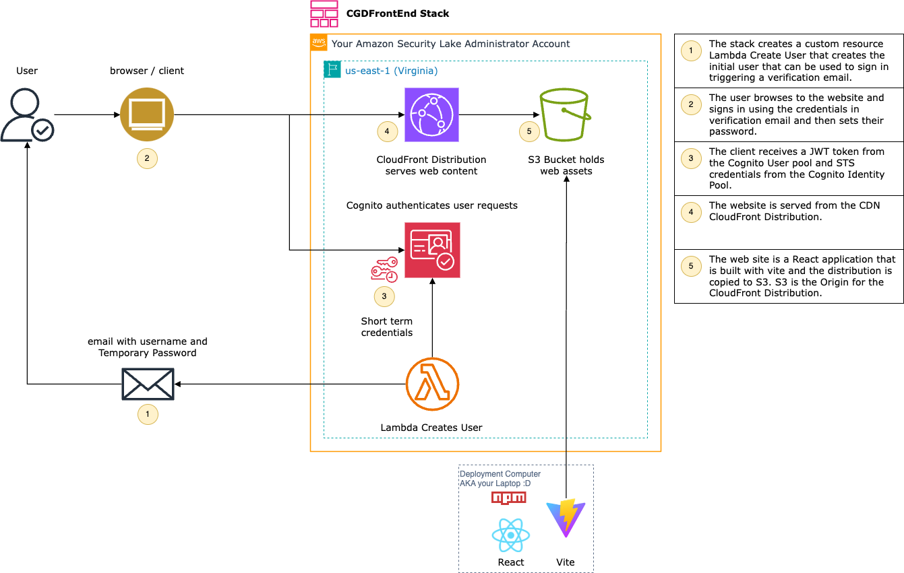
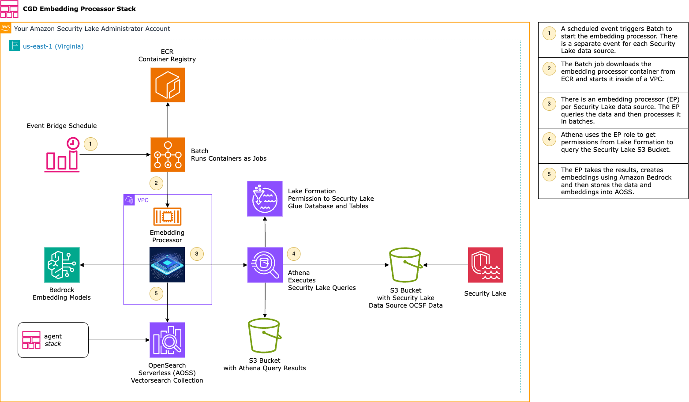
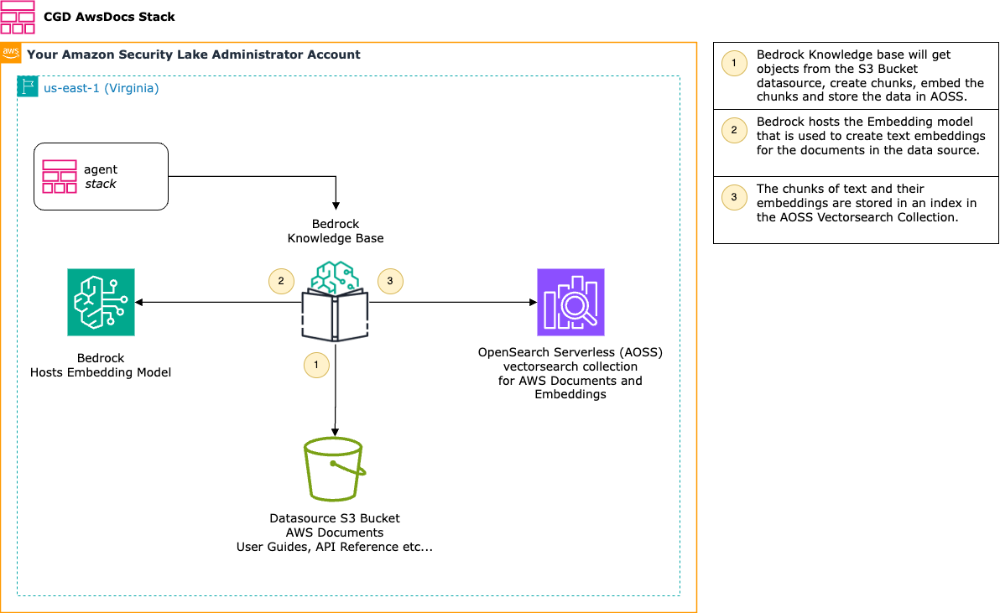
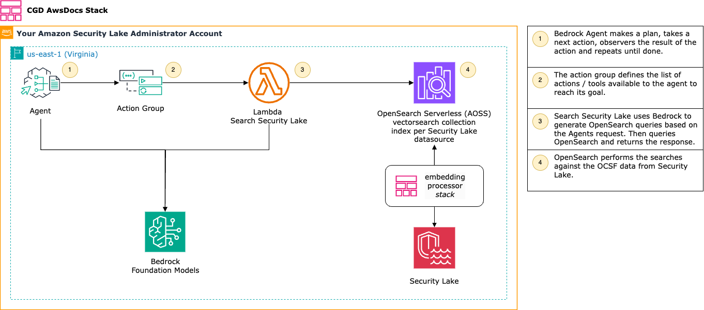
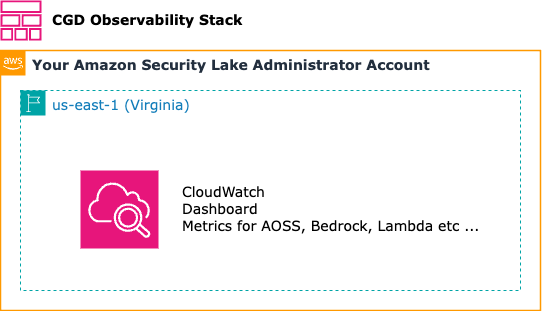

# Overview of CloudFormation Stacks

The deployment will create five CloudFormation stacks in your account. The following diagrams illustrate the key resources and the how each stack works.

## Front End (CGDFrontEnd)
The frontend stack creates the resources needed for the React Application and user authentication.

## Embedding Processor (CGDEmbeddingProcessor)
The embedding processor stack creates the resources that copies OCSF data from Amazon Security Lake data sources into Amazon OpenSearch Serverless. The embedding processor also creates embeddings using Amazon Bedrock.

## AWS Docs (CGDAwsDocs)

The AwsDocs stack creates a Bedrock Knowledge base with an S3 bucket as a datasource. You can they copy AWS Documents to the S3 bucket and sync this datasource to provide the agent with current knowledge. 

## Agent (CGDAgent)

The AgentStack creates the Bedrock Agent and the Action group. The Agent can then use the action group to search for Security Lake data in AOSS.

## Observability (CGDObservability)

The Observability stack creates a CloudWatch dashboard to visualize metrics for Bedrock, Lambda, AOSS and other resources in the environment.

